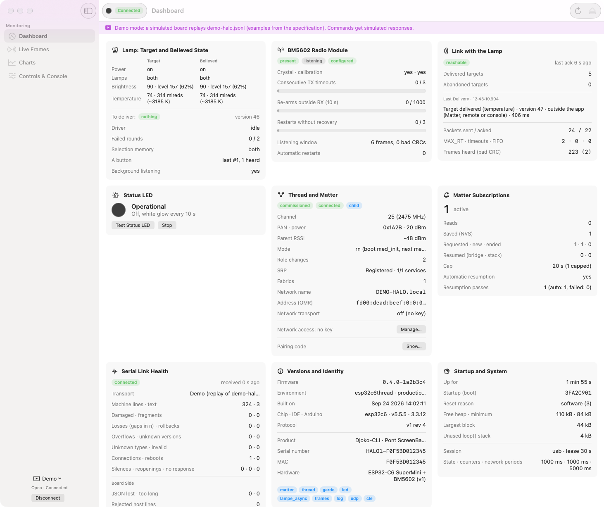
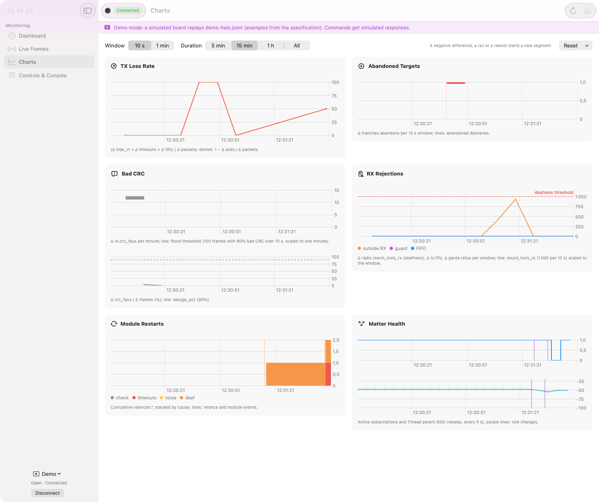
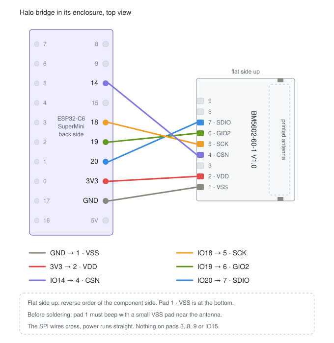

[Français](README.fr.md) · **English**

# BenQ ScreenBar Halo → Matter

Control a **BenQ ScreenBar Halo (1st generation)** from any home-automation
app, by having an ESP32 pose as its 2.4 GHz remote.

The ESP32 is a native **Matter node**: no Homebridge, no MQTT broker. Since
Matter is multi-admin, the same device can be shared between several
ecosystems at once — see the certification caveats below.

Every document comes in English and in French (the `.fr.md` files), with a
language switch at the top.

## What is exposed

| Endpoint | Matter type | Controls |
|---|---|---|
| EP1 "Halo" | Color Temperature Light | on/off, brightness, temperature 153-370 mireds |
| EP2 "Halo avant" | On/Off Light | front lamp on (power AND front lamp) |
| EP3 "Halo arriere" | On/Off Light | back lamp on (power AND back lamp) |
| ~~EP4 "Halo auto"~~ | On/Off Plug-in Unit | **disabled by default** (see below): presses button A (auto mode), turns itself back off after 1 s (`matter impulsion <ms>`); pressing A on the remote triggers the same pulse |

- A radio frame carries a single value: both lamps share brightness and
  temperature, hence a single slider of each on EP1.
- Turning EP1 on restores the last lamp selection, like the remote's power
  button. Turning off EP2 then EP3 turns the lamp off.
- EP4, if re-enabled, is ignored when the lamp is off, and when it arrives
  together with a power or lamp command (room command, grouped tile): in
  Apple Home, show the accessories as separate tiles.
- Names are set in the app. The Kelvin values (~6500 to ~2700 K) are
  nominal, not measured.
- In `src/config.h`: `HALO1_SELECTORS_AS_LIGHTS 0` exposes EP2 and EP3 as
  outlets (a room-wide "turn off the lights" no longer touches them).
- Nothing is sent to the lamp at startup: the node restores the saved state,
  and only a command (Matter or `lampe ...`) triggers a transmission.

> **Upgrading to 0.3.0 from EP1..EP4** (Halo, front, back, auto): flash over
> the same environment (`pio run -e esp32c6thread -t upload` for the Apple
> Home Thread node), without `-t erase` or `decommission`: the pairing is
> kept, only EP4 disappears.
>
> **From the old endpoint layout** (power, front light, back halo, sensor,
> auto mode): the node must be commissioned again. Remove the accessory from
> each app, run `decommission` (or hold BOOT for 8 s, then release), then add
> it again with the pairing code (`matter`).

### EP4 "Halo auto": disabled for now

Since 0.3.0 (decision of Sep 23), `HALO1_EXPOSE_AUTO` defaults to 0: button A
is no longer exposed in Matter. The code remains, but is compiled out of the
firmware: no endpoint, no mirroring of the remote's A presses, no pulse
setting (`matter impulsion` says so, `matter` shows « bouton A (EP4) :
desactive »). EP1 to EP3 keep their numbers (EP4 was created last). Button A
remains available from the console: `lampe auto`.

On a node that is already paired, EP4 disappears from the node's endpoint
list; how Apple Home removes the "Halo auto" tile remains to be checked in
the field.

To **bring it back**, add `-DHALO1_EXPOSE_AUTO=1` to the environment's
`build_flags` (for example `[env:esp32c6thread]` in `platformio.ini`), or
change the default in `src/config.h`, then reflash the same environment
(`pio run -e esp32c6thread -t upload`, without erasing). EP4 comes back with
the same number, its pulse duration saved in NVS (`halo1/impulsion`) is
restored, and the app shows it as a new accessory to place.

### Node identity

The Basic Information cluster (EP0) carries the product identity, set at
every boot before `Matter.begin()` (values in `src/config.h`, `MATTER_*`
macros, overridable with `-D`):

| Attribute | Value |
|---|---|
| VendorName | `Djoko-CLI` |
| ProductName | `Pont ScreenBar Halo` |
| NodeLabel | `Halo` (rewritten at every boot: a name written to this attribute by a controller is replaced) |
| SerialNumber | `HALO1-` + the factory MAC address as 12 hex digits, unique per board |
| HardwareVersion / HardwareVersionString | `1` / `ESP32-C6 SuperMini + BM5602` |
| SoftwareVersionString | `0.4.0-<commit>` ("Firmware" in Apple Home) |

- The VID and PID do not change (`0xFFF1` / `0x8000`, test certificate), nor
  do the discriminator and the pairing code: no re-commissioning. An app may
  take a while to re-read these values.
- `SoftwareVersionString` is the version from the application descriptor
  (`esp_app_desc`), which `src/app_desc.c` replaces: without it, it was the
  commit of Arduino's lib-builder (`6671d0b`). `FW_VERSION` is set in
  `platformio.ini` (`build_src_flags`); the commit comes from
  `tools/git_rev.py`, followed by `-dirty` if a tracked file was modified at
  build time, or if an untracked file was lying in `src/`, `include/` or
  `lib/`.
- `matter` shows these values as the stack reports them (`identite` and
  `versions` lines), except the NodeLabel (requested value, not read back),
  and flags any rejected value. Boot prints `firmware 0.4.0-<commit>` and
  warns if the descriptor read from the flashed image differs. Without a
  board, the same version (`App version`) can be read with:
  `pio pkg exec -p tool-esptoolpy -- esptool.py --chip esp32c6 image-info .pio/build/<env>/firmware.bin`.

## Companion app (macOS)

[Halo Compagnon](apps/macos/README.md) supervises the bridge over USB or over
the Thread network: target and raw state of the lamp, radio module, Thread
and Matter, live decoded frames, charts, commands and console. Screenshots in
demo mode (no hardware):

<p>
  
  
</p>

## Hardware

| Part | Role | Approx. price |
|---|---|---|
| **ESP32-C6 SuperMini** | MCU + Thread radio + Matter | ~€5 |
| **Holtek BM5602-60-1 RF module** | 2.4 GHz transceiver | ~$3–4 |
| 100 nF + 10 µF | decoupling of the module's supply | — |

### Why the ESP32-C6

The bridge joins Apple Home over **Matter over Thread** (`esp32c6thread`
target). It needs an 802.15.4 radio: among the boards tried, only the C6 has
one. The C3, the S3 and the classic ESP32 only have Wi-Fi. Their targets still
build, as Matter over Wi-Fi, but the bridge does not use them and they are no
longer tested.

| Target | Matter network | Commissioning | Firmware size |
|---|---|---|---|
| **ESP32-C6 SuperMini** (`esp32c6thread`) ✅ | Thread | BLE | 2.50 MB |
| ESP32-C3, ESP32-S3 | Wi-Fi only | BLE | 1.79 / 1.97 MB |
| Classic ESP32 | Wi-Fi only | IP: credentials set first (`wifi <ssid> <mdp>`), the Bluetooth stack does not fit | 1.81 MB |

C6 size measured on Sep 24 (2,616,992 bytes). The other targets have not been
rebuilt since: their figures are older.

### Why the BM5602 and not a CC2500 or an nRF24L01+

The BenQ transmits **GFSK at 125 kbps**, with an Enhanced ShockBurst frame
format: preamble, 4-byte address, 9-bit PCF, CRC, and above all **hardware
auto-ACK** — the lamp answers *only* in the ACK slot.

| Chip | 125 kbps | Arbitrary 32-bit sync word | ESB auto-ACK |
|---|---|---|---|
| nRF24L01+ / BK2425 | ❌ 250 k / 1 M / 2 M only | ✅ | ✅ |
| CC2500 | ✅ | ❌ the 32-bit mode repeats the 16-bit word | ❌ must be done in software |
| **BC5602 / BM5602-60-1** | ✅ 125 / 250 / 500 k | ✅ | ✅ |

The nRF24 is ruled out right away: it cannot go down to 125 kbps. The CC2500
can, but you would have to reimplement the nRF24 CRC in software (computed
over address + PCF + payload, not the CC2500's), work around the sync word
limit, and produce the ACK within a window of about 130 µs. Doable on paper,
very painful in practice.

The BC5602 is **exactly the chip inside the lamp and the remote** (confirmed
by the FCC filings and by a PCB teardown). The whole protocol is handled in
hardware.

### Where to buy it

The module is the project's main friction point — it is not a mass-market
part.

- [Best Modules Corp](https://www.bestmodulescorp.com/en/bm5602-60-1.html) —
  a Holtek subsidiary, ~$3.10–4.28
- [Sourcengine](https://www.sourcengine.com/part-info/BM5602-60-1-145144816391)
- Official Holtek distributors
- [Holtek product page](https://www.holtek.com/page/vg/BM5602-60-1)

Buy two: at ~$4 each, it saves you wondering whether the module is dead when
something does not work.

## Wiring

See [docs/WIRING.md](docs/WIRING.md). In short, on the ESP32-C6 SuperMini
(the default target):

| BM5602 | C6 SuperMini |
|---|---|
| `VDD` / `VSS` | 3V3 / GND |
| `SCK` | IO18 |
| `GIO2` | IO19 (MISO) |
| `SDIO` | IO20 (MOSI) |
| `CSN` | IO14 |

> `GIO2` serves as MISO: the firmware switches the module to 4-wire SPI at
> init. The module has no markings, and the order of its pads reverses
> depending on the side you look at: see
> [docs/WIRING.md](docs/WIRING.md#bm5602-60-1-module-pinout).

In the enclosure, the C6 lies upside down (seen from the back) and the BM5602
flat side up, turned a quarter turn, antenna away from the C6:

<p align="center">
  
</p>

## Building

```bash
pio run -t upload -t monitor
```

The default target is `esp32c6thread` (Matter over Thread), the bridge's. The
others are selected with `-e`: `esp32c6supermini` (Matter over Wi-Fi),
`esp32c3`, `esp32s3`, `esp32dev`.

> Do not flash a Wi-Fi build onto a node paired over Thread: the pairing stays
> in NVS, but the node becomes unreachable until the Thread build comes back.

If the board boot-loops right after flashing, the clone's flash memory does
not like QIO mode: add `board_build.flash_mode = dio` to the environment.

Two build constraints, both already set in `platformio.ini`:

- **The platform is the [pioarduino](https://github.com/pioarduino/platform-espressif32) fork.**
  The Matter library ships with the Arduino-ESP32 3.x core (nothing to
  install through `lib_deps`), whereas PlatformIO's official platform stayed
  on core 2.0.x, which has no Matter at all.
- **`huge_app.csv` partitions** (3 MB APP). The Matter stack alone weighs
  ~1.4 MB. Accepted consequence: **no OTA** on a 4 MB flash.
  `min_spiffs.csv` would leave room for OTA but only fits on the C3 and the
  classic ESP32, with ~150 KB of headroom — it overflows on the S3 and C6.

## Commissioning

### 1. Check the link with the lamp

The firmware already knows the lamp's link address: `63 FD F0 4F` on air,
i.e. `4FF0FD63` in the BM5602's write order, channel 5 (2405 MHz), 125 kbps.
`lampe adresse` shows it. Nothing to search for.

In the serial monitor, listen to the remote while you use it (30 s by
default):

```
ecoute 4FF0FD63 5
```

Every gesture should print frames decoded with a correct CRC (`C4 xx` for
the dial, for example). Then `lampe` shows the driver state: target, raw
state, fields to deliver, link and radio. A first command, `lampe on` or
`lampe lum A0`, should end with an `ok ... accuses` line.

The link address depends on the remote (it comes from BenQ's pairing). For
another lamp/remote pair, `lampe adresse XXXXXXXX` (write order) stores it
in NVS. How it was found: [docs/PROTOCOL.md](docs/PROTOCOL.md).

### 2. Pair the Matter node

The pairing code is printed at boot, and `matter` shows it again:

```
code manuel : 34970112332
```

A Matter controller is required — HomePod, Apple TV, Google Nest, Echo, or
Home Assistant's *Matter Server* add-on.

Holding the **BOOT** button for 8 s, then releasing it, or the
`decommission` command, removes all fabrics so you can re-pair from scratch
(see "4. BOOT button").

### 3. Status LED

The product's indicator is the board's RGB LED (WS2812), on IO8, in the
`esp32c6thread` and `esp32c6supermini` builds. Low brightness, since it
lives under the desk: 24/255 at most per channel, 8/255 for the white glow.

| LED | Meaning |
|---|---|
| blinking blue (2 Hz) | not commissioned yet: add the accessory from the app |
| slow orange (1 s on, 1 s off) | commissioned, but no network (Thread lost; Wi-Fi for `esp32c6supermini`) |
| off, brief white glow every 10 s | all good (sign of life); also a glow when the network comes back |
| steady red | radio module down: automatic restarts did not help (see below), or module lost; lasts until it recovers |
| green flash (150 ms) | a command has just been delivered to the lamp (acknowledged) |
| red, 3 blinks | lamp unreachable: the driver gives up the command (also when the radio module is lost or down) |
| rainbow | "Identify" requested from Apple Home (Identify cluster), for the whole identification |
| red, black, purple, black, fast | BOOT button held 8 s: release to unpair, then unpairing in progress until the reboot (see "4. BOOT button") |
| white flash (150 ms) | BOOT button, short press released: reboot |

Priority: rainbow > BOOT button > red ×3 > steady red > green > network state
(the blacks of the three blinks remain visible over the steady red). On the
bench, `led test` plays each pattern in turn (21 s; the button takes over)
and `led` reports the current pattern and the radio module state. If green
and red are swapped, the board's WS2812 is not GRB:
`-DSTATUS_RGB_ORDER=LED_COLOR_ORDER_RGB` in `platformio.ini`.

The small LED on IO15 stays an input, so it is off whatever its polarity: a
single indicator. As an input, it also does not interfere with the CC2500's
GDO2, which lands on IO15 when the capture board is plugged in. The
diagnostic build only sets the WS2812 to black at boot: it keeps its last
color across a reset or a flash, and a product build's blue would otherwise
stay lit on the bench. Among the other targets, only `esp32dev` blinks its
simple LED (IO2) with the same patterns, without the glow; on the C3 and S3
DevKits, `PIN_STATUS_LED` (IO8, IO48) is the pin of their WS2812, not
declared: no visible indicator.

**Automatic radio module restart.** On Sep 24, the metal tip of a sliding
caliper resting on the BM5602's crystal locked it up for ~70 min: every
transmission timed out (186 in a row at the end), listening went deaf (no
frame at the end, after ~96,000 frames with a bad CRC since boot), while its
configuration still read back correctly; only `rfinit` cured it. So the
driver restarts the module on its own (`halo.begin()`, ~300 ms, up to
~0.5 s if the crystal or the calibration do not respond) on three chip
symptoms: 3 transmissions in a row with neither TX_DS nor MAX_RT (30 ms
timeout); while listening, at least 100 frames in 10 s, of which at least
90 % with a bad CRC (the remote's dial produces ~9 per second, with a
correct CRC); or deaf listening, at least 1000 re-arms in less than 10 s on
a chip that does not stay in receive mode (the incident produced ~450 per
second, seen within ~2-3 s; normally estimated at well under one per second,
inferred from the totals, to be confirmed with « hors RX » in
`lampe stats`). An unplugged lamp (MAX_RT, silence) never triggers a
restart. At most one restart per minute; after 3 restarts in a row without
recovery (an acknowledgement, a listening window with mostly correct CRCs,
or, after a restart for deafness, 10 s of listening during which the chip
stays in receive mode with no timed-out transmission), if the symptom comes
back, the module is **DOWN**: steady red, one attempt every 10 min. Each
restart writes `[lampe] BM5602 : ...` lines on the console (never blocking:
lost if the serial buffer is full); `lampe` shows the state and the last
restart, `lampe stats` the restarts by cause and the latest ones, with
timestamps. Details and thresholds:
[docs/PLAN-PILOTE-HALO1.md](docs/PLAN-PILOTE-HALO1.md), C.5.

### 4. BOOT button

In the 3D-printed case, only **BOOT** (IO9, marked B) remains accessible: no
RST. So it is used to reboot and to unpair. Everything is decided **on
release**:

| Press | LED during the press | On release |
|---|---|---|
| less than 2 s | nothing special | white flash (150 ms), then **reboot** (lamp state saved first, like `reboot`) |
| 2 to 8 s | nothing special | **cancelled**: nothing happens (safeguard against a mistake) |
| 8 s or more | red, black, purple, black, fast (100 ms each) from 8 s: "release to unpair" | **unpairing**: removal of all Matter fabrics (the accessory leaves Apple Home), then reboot; the LED keeps the red/purple until the reboot |

IO9 is a strapping pin: **held low at reset, it makes the C6 boot into
download mode**, where it stays inert until a power cycle. So the firmware
never acts while the button is pressed: it waits for the release (30 ms
debounce), then 100 ms of uninterrupted high readings, and reads the pin
again 100 ms right before acting (pressed and held again at that moment, the
action is abandoned). Finally, **every** software reboot (button, `reboot`,
`decommission`, and the end of unpairing, which the Matter stack triggers
itself a while later) waits until the pin has read high for 50 ms in a row:
BOOT held during a reboot delays it until release, with no limit (a stuck
button blocks the board, which restarts as soon as it is released, instead
of leaving it in download mode). Other safeguards:
- a button already pressed at boot is ignored until it is released;
- a new press while an action is pending abandons it: it counts on its own;
- during unpairing, the button is inert (a reboot in the middle of the erase
  would leave Matter half removed); if the board is still running 10 s
  later, it reboots on its own;
- if `loop()` was blocked for more than 100 ms during the press or at one of
  its edges (bench tool, radio module restart), the duration is uncertain:
  the press is ignored (except a long press already armed, which is
  certain);
- every decision is announced on the console, `[bouton] ...` (`log`
  message, `src` `bouton`, in `json log 1` mode, outside the log cap).

Diagnostic build (no Matter, no LED): a short press reboots; a long press
only explains itself on the console. Pure logic, tested on the host:
`src/boot_button.*`.

### Certification: what works and what needs an extra step

The firmware uses the **Matter SDK test certificates**: `VID 0xFFF1`,
`PID 0x8000`. This is the normal development mode, but each ecosystem
treats it differently:

| Ecosystem | Behavior |
|---|---|
| **Home Assistant** | accepts it directly (Matter Server) |
| **Apple Home** | adds the accessory while showing an "uncertified accessory" warning, which you just confirm |
| **Google Home** | refuses it, unless you create a project in the [Google Home Developer Console](https://developers.home.google.com/matter/get-started) declaring the same test VID/PID pair |
| **Alexa** | not checked |

Removing the warning entirely would require a CSA-assigned VID and a
certification — out of reach for a personal project.

## Serial commands

`help` lists everything. Commands and their output are in French.

| Command | Effect |
|---|---|
| `info` | hardware, radio configuration, driver state |
| `matter` | Matter state, pairing code, node identity and versions, bridge counters, Identify requests |
| `matter impulsion [300..15000]` | duration of the EP4 pulse in ms, kept in NVS (only when EP4 is re-enabled; otherwise a message says so) |
| `matter reprise` | (Thread) immediately restarts the resumption of Apple Home's saved subscriptions |
| `matter reprise auto [0\|1]` | (Thread) restarts on its own after a reboot: Thread + SRP ready for 10 s, not before 50 s (plus the saved floor), for each saved subscriber with no active subscription; CASE session first (a failure costs the stack nothing), then resumption; then 30 s, 60 s, 5 min after each failure, and a check every 5 min as long as a subscription is active (NVS) |
| `matter med [0\|1\|2]` | (Thread) device type at the next boot: 0 router, 1 MED from init (no new attach), 2 MED after `Matter.begin()` (old behavior) (NVS) |
| `matter maxint [0\|10..3600]` | (Thread) cap on the max interval of new subscriptions, 20 s by default, 0 = the controller's (NVS). Only applies from Apple's next new subscription: a resumed subscription keeps its saved interval |
| `lampe` | Halo 1 driver: target, raw state, fields to deliver, link, radio |
| `lampe on` / `lampe off` | turn on / off, same rules as Matter |
| `lampe avant on\|off` / `lampe arriere on\|off` | one lamp, front or back (like EP2 / EP3) |
| `lampe mode avant\|arriere\|deux` | lamps lit (and power on) |
| `lampe lum 4C..FE` / `lampe niveau 1..254` | raw brightness (hex) / Matter level |
| `lampe temp 0..100` / `lampe mired 153..370` | temperature: 0 cold, 100 warm / in mireds |
| `lampe auto` | button A (refused when the lamp is off) |
| `lampe sync` | resends everything known |
| `lampe trace 0\|1` / `lampe stats` | per-event log / counters, including the automatic module restarts by cause |
| `lampe adresse [8 hex]` | lamp address (write order), in NVS |
| `lampe help` | all `lampe` commands (settings and bench) |
| `led` | status LED: current pattern, displayed color, radio module state |
| `led test` / `led stop` | plays each LED pattern in turn (21 s), without blocking / stops it |
| `ecoute 4FF0FD63 5 [ms]` | passive listening to the remote, never acknowledging |
| `txack <adr> <canal> <charge> [n] [ms]` | bench: standard-format transmission, automatic acknowledgement, verdict per attempt |
| `regs` | dump of the BC5602 registers |
| `rfinit` | re-tests the module after fixing the wiring, without reflashing |
| `wifi <ssid> <mdp>` | Wi-Fi credentials (classic ESP32 only) |
| `decommission` | removes all Matter fabrics |
| `reboot` | saves the lamp state, then reboots |

`help` also lists the bench and reverse-engineering tools: `prxack`, chip,
spectrum and GIO3 probes, CC2500 module. `addr` and `chan` only configure
those tools; the driver has its own address (`lampe adresse`).

A line longer than 127 characters is refused (`Ligne refusee (trop_long)`),
instead of being truncated and then executed; Ctrl-U clears the current
line.

### Machine mode (companion app, since 0.4.0)

The supervision app (macOS first) talks to the board over the same USB
port, or over the Thread network (UDP, section 10), with the protocol in
[docs/PROTOCOLE-JSON.md](docs/PROTOCOLE-JSON.md): it sends console commands
prefixed with `id=<n> `, and the board answers with machine lines (RS byte
0x1E + a compact JSON object + LF, 1024 bytes at most), mixed with the usual
text. Without `json 1` and without `id=`, the human console is unchanged.

| Command | Effect |
|---|---|
| `json` | session state, as text |
| `json 1 [bail 0\|10..600]` | machine mode: echo, prompt and `Serial.flush()` disabled; `hello`, `config`, then the full snapshot; 30 s lease by default, renewed by any received line (`json ping`); `bail 0` on the bench: until `json 0` |
| `json 0` | back to human mode (`fin` message, then the prompt); over the network, also frees the session's slot (rev 4) |
| `json etat` / `json hello` | snapshot (`etat`, `compteurs`, `reseau`) / `hello` and `config`, once, even in human mode |
| `json periode\|compteurs\|reseau <ms>` | periods of the `etat` messages (0 or 200..60000, 1000 by default), `compteurs` (same), `reseau` (0 or 1000..60000, 5000); `hb` every 2 s if the `etat` messages are off or slow |
| `json trames 0\|1` / `json log 0\|1` | `rx` and `tx` events (on by default) / `[lampe]` and `[matter]` announcements as `log` messages instead of text |

- With `id=`, every line receives a `reponse`; the `lampe` state commands
  (`on`, `off`, `avant`, `arriere`, `mode`, `lum`, `niveau`, `temp`,
  `mired`, `auto`, `sync`) become asynchronous: `reponse` right away (code
  `accepte`, `differe` or `ok`), then `livraison` when the driver is done.
  The other commands keep their text, between `reponse debut` and
  `reponse fin`.
- The board never waits for the app: a line that does not fit in the
  transmit buffer is lost and counted (`etat.sante.sys.json_perdus`), and
  `n` skips. One exception, without blocking the loop: a deferred `reponse`
  (after the snapshot of `json 1`, `json etat`, `json hello`, or the `fin` of
  a command whose text filled the buffer, such as `help`) waits in a queue
  for room for a whole line. At most 20 lines per second from the host
  (`cadence`).
- Nothing is persisted: every boot starts in human mode. `json cle` sets the
  network transport key (section 10.4), over USB only.
- On the bench, `python3 tools/json_check.py <capture>` checks a raw capture
  of the port (framing, types, required fields, sizes, gaps in `n`); a field
  unknown to v1 is only a warning (`--strict`: an error).

## Halo 1 protocol

The protocol is established, and verified by transmitting to the lamp:
standard BC5602 frame (4-byte address, 9-bit PCF, hardware CRC-16), two-byte
payload (power / lamps / selector flags, then value), empty
acknowledgement. So the lamp's state cannot be read: the driver tracks the
state it sends and what it hears from the remote. Details, evidence and
still-open questions: [docs/PROTOCOL.md](docs/PROTOCOL.md) (header block,
then the Halo 1 sections at the end).

## Layout

```
platformio.ini            4 ESP32 targets, pioarduino platform, huge_app partitions
src/config.h              pins, Halo 1 driver settings, Matter identity
src/fw_version.h          firmware version (FW_VERSION + git revision)
src/app_desc.c            application descriptor: version reported by Matter
src/bc5602.{h,cpp}        low-level transceiver driver
src/cc2500.{h,cpp}        minimal CC2500 driver: raw listening (cc* commands)
src/swd.{h,cpp}           bit-banged SWD (swd command)
src/halo.{h,cpp}          module startup (also the driver's restart), bench tools
src/halo1_proto.{h,cpp}   pure Halo 1 protocol: frames, CRC, scheduling
src/halo1_map.{h,cpp}     Matter <-> lamp mappings, intent rules
src/halo1_radio.{h,cpp}   proven BC5602 sequences, non-blocking reconfiguration
src/halo1_watch.{h,cpp}   when to restart the module on a chip symptom (pure logic, tested on the host)
src/halo1_lamp.{h,cpp}    driver: target, acknowledged bursts, tracking of the remote
src/cli_lampe.cpp         'lampe ...' commands
src/matter_bridge.{h,cpp} Matter endpoints, intent box, mirror of the target, Identify
src/matter_resume.h       resumption schedule of Matter subscriptions (Thread bridge)
src/halo1_events.h        driver events as plain data (frames, packets, restarts, module)
src/json_out.{h,cpp}      JSON protocol: machine line writer, messages, queue (pure, tested on the host)
src/json_mode.{h,cpp}     machine mode: session, 'json' commands, periodic state, events, deliveries
src/h1_proto.{h,cpp}      H1 envelope of the network transport: sessions, MAC, replay (pure, tested on the host)
src/h1_crypto.cpp         HMAC-SHA256 and SHA-256 (mbedTLS)
src/net_udp.{h,cpp}       network transport: UDP over Thread, port 5480, key in NVS
src/status_led.{h,cpp}    status LED: patterns and priorities (pure logic, tested on the host)
src/boot_button.{h,cpp}   BOOT button: short press = reboot, 8 s = unpair (pure logic, tested on the host)
src/net.{h,cpp}           Wi-Fi for targets without BLE commissioning
src/cli.{h,cpp}           reverse-engineering serial console
src/main.cpp              assembly
docs/PROTOCOL.md          radio protocol, known / to confirm, capture methods
docs/PROTOCOLE-JSON.md    JSON protocol between the board and the companion app (machine mode)
docs/WIRING.md            wiring and hardware pitfalls
docs/AUDIT-2026-09-23.md  audit of the frame format and of the bugs, with their status
docs/PLAN-PILOTE-HALO1.md Halo 1 driver plan, steps and bench results
docs/BRIEF-BOITIER.md     brief for the 3D-printed case
docs/PISTES-FUTURES.md    ideas outside the current scope
docs/ETUDE-THREAD-COMPAGNON.md  study of the network transport and of the companion app
apps/macos/               macOS companion app (SwiftUI): USB and Thread network
tools/test_halo1.sh       host tests of the Halo 1 protocol, module watchdog, status LED, BOOT button and JSON protocol, without a board
tools/json_check.py       checks captured machine lines (and the examples in docs/PROTOCOLE-JSON.md)
tools/git_rev.py          git revision for FW_GIT_REV (PlatformIO dynamic flag)
tools/halo_udp.py         bench client of the network transport (key, session, refusal)
tools/macos/halo-routes/  macOS system helper that keeps the Thread route (kernel bug)
```

## Credits

The Halo 2 protocol was reverse-engineered by
[kuzmin-no](https://github.com/kuzmin-no/BenQ_ScreenBar_HALO_2_HA_integration)
(MicroPython, Raspberry Pi Pico W, MQTT output). This project started as a
C++ port of that work, for ESP32 with native Matter; the Halo 1 turned out to
speak a different protocol (two-byte payload, empty acknowledgement), and the
Halo 2 layer was removed once the Halo 1 driver was validated.

Identifying the BC5602 in the Halo 1 is credited to `hertzg`, and the PCB
teardown to `b4shful`, on the
[Home Assistant thread](https://community.home-assistant.io/t/benq-screenbar-support/490864).
