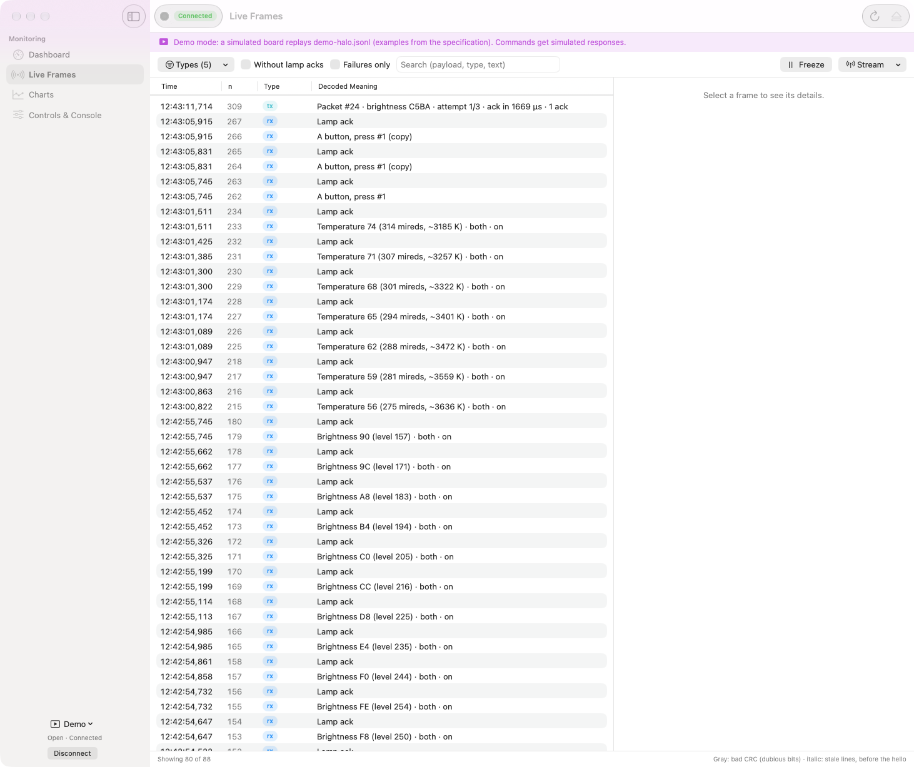
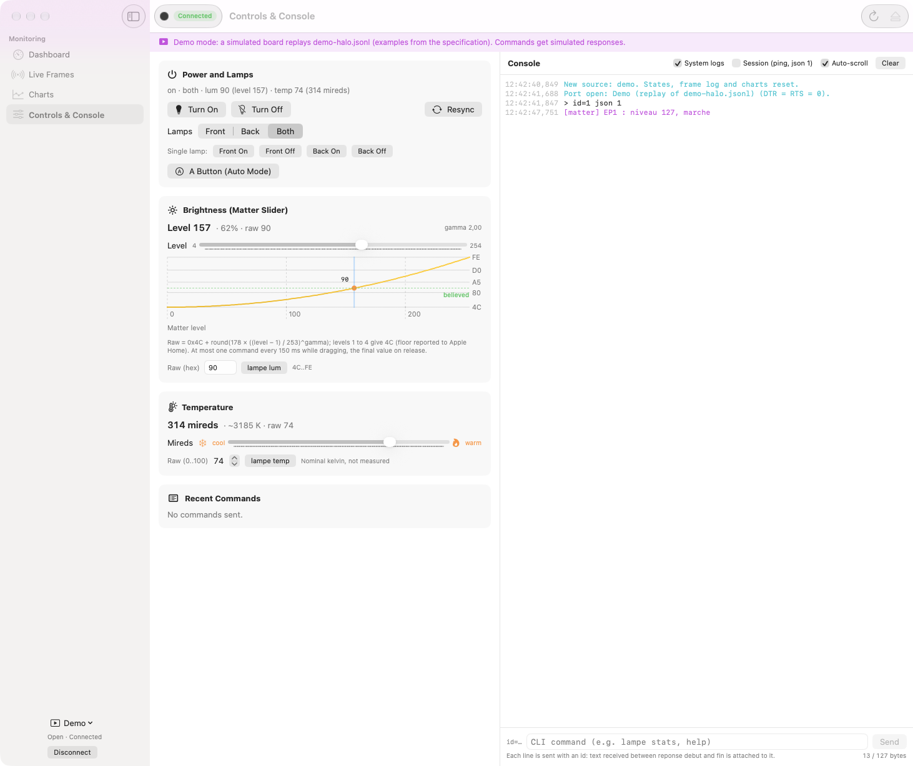

[Français](README.fr.md) · **English**

# Halo Compagnon (macOS)

Native SwiftUI app that supervises the BenQ ScreenBar Halo 1's ESP32-C6
bridge over USB or over the Thread network (UDP, section 10), following the
machine protocol from [`docs/PROTOCOLE-JSON.md`](../../docs/PROTOCOLE-JSON.md)
(v1). The same protocol code will later serve the iOS app.

> **Status.** Tried on the bench with the bridge (firmware 0.4.0, protocol
> revision 4) on Sep 25 and Sep 27, over USB and over the Thread network: see
> "To Verify on the Bench". Faced with older firmware, the app detects it
> (`Commande inconnue : "id=1"`) and stays in console-only mode. Everything
> can be seen in **Demo Mode**, with no hardware: the screenshots below come
> from it.

## Screenshots

Demo Mode, no hardware: dashboard, live frames, charts, controls and console.

<p>
  
  
  
  
</p>

## The Four Screens

| Screen | Content |
|---|---|
| **Dashboard** | Target and raw state side by side (mismatches and fields awaiting delivery in orange), pilot phase, active slices; link with the lamp (acks, deliveries, drops); BM5602 module (mode, delay / deafness / restarts-without-recovery gauges, **DOWN** banner); status LED animated from `status_led.h` (and `led test`); Thread and Matter (role, parent RSSI, SRP, fabrics, network name and OMR address, network transport); Matter pairing: **Add to Home** card up front when the bridge is not commissioned (large QR code, 11-digit code grouped as in Home, Copy button, steps), otherwise a **Pairing code…** button in the Thread and Matter card (the bridge's label, and when it applies; codes received over USB only, firmware revision 3); subscriptions; serial link health (damaged lines, fragments, `n` gaps, JSON lost on the board side, last rejected line); versions, identity, capabilities; startup (`boot`, cause, `up_s`) and system. |
| **Live Frames** | `rx`, `tx`, `livraison`, `relance` events (and `module`, `intent`, `abonnement`, `thread`, `led`, `reponse`...) with their decoded meaning ("Brightness A5 (level 180) · both · on", "MAX_RT (no ack) at 11476 µs"...). Filters by type, without the lamp's acks, failures only, search; detail and JSON for each frame. Bad CRC in gray, old lines (before the `hello`) in italics. Stream menu: `json trames 0/1`, `json log 0/1`, `lampe ecoute 0/1`. |
| **Charts** | Swift Charts, computed as section 8 describes: `compteurs` block differences over a 10 s or 1 min window, new segment on a negative difference, `raz`, or restart. TX loss rate and its complement, dropped targets (and `livraison` `abandon` markers), bad CRC per minute and as a share of frames (flood thresholds), reception refusals (`rearm_hors_rx` with the deafness threshold, `tx.fifo`, `garde.refus`), stacked restarts by cause (`relance`, `module` markers), Matter health (active subscribers, parent RSSI, role changes). `lampe stats raz` with confirmation. |
| **Controls & Console** | Turn on, turn off, lamps (`lampe mode`, `lampe avant/arriere on/off`), button A, `lampe sync`; brightness slider in Matter level with the board's gamma mapping (`gamma_c`) plotted (level → raw 4C..FE); temperature slider from coldest to warmest (mireds, nominal Kelvin, raw value); raw values (`lampe lum`, `lampe temp`); recent commands and their fate (accepted, delivered, dropped, no response...). Raw console: each line leaves with an `id`, the text received between `reponse debut` and `fin` is attached to it, `reponse` and `livraison` are rendered human-readable there. |

## Build, Test, Run

Requirements: macOS 15 or later, Xcode 16 or later (developed with Xcode 27),
[XcodeGen](https://github.com/yonaskolb/XcodeGen) (`brew install xcodegen`).
No third-party dependencies. The Xcode project is generated: only
`project.yml` is tracked.

```sh
cd apps/macos
xcodegen generate
xcodebuild -project HaloCompagnon.xcodeproj -scheme HaloCompagnon -destination 'platform=macOS' build
xcodebuild -project HaloCompagnon.xcodeproj -scheme HaloCompagnon -destination 'platform=macOS' test
```

Swift 6 (full strict concurrency), warnings treated as errors: the build
produces no warnings at all.

Running it: open `Halo Compagnon.app` (in `DerivedData/.../Build/Products/Debug/`),
or `xed .` then ⌘R. Useful launch arguments:

```sh
open "…/Halo Compagnon.app" --args -demo -ecran trames   # démo directe, écran choisi
```

(`-ecran`: `tableau`, `trames`, `graphiques`, `commandes`.)

The app **never opens a port on its own**: you have to choose a source in
the sidebar (the Espressif port, VID 303A, is offered first) or Demo Mode
(⇧⌘D).

### Signing for the Network Source

`Signature.xcconfig` (committed) signs ad hoc by default: the repo builds
and tests everywhere, with no Apple account, but with no stable local
network authorization and no keychain that survives from one build to the
next. For the network source, create `apps/macos/Local.xcconfig` (ignored
by git, see `.gitignore`):

```
DEVELOPMENT_TEAM = <équipe, 10 caractères>
CODE_SIGN_IDENTITY = Apple Development
```

Team: `security find-certificate -c "Apple Development" -p | openssl x509 -noout -subject` (the OU field).

Two pitfalls hit on Sep 25:
- **Sandbox container.** Switching from an ad hoc install to team signing
  on an already-installed app: macOS protects the container created by the
  first ad hoc build. Quit the old app, then accept the system prompt about
  access to "other apps' data" — otherwise hosted tests stay stuck on
  "test runner hung before establishing connection".
- **`DerivedData` under `~/Documents`.** macOS adds extended attributes
  there that the test bundle's ad hoc signature rejects ("resource fork,
  Finder information, or similar detritus not allowed"). Always build with
  a `-derivedDataPath` outside `~/Documents`, for example:

  ```sh
  DD=$HOME/Library/Developer/Xcode/DerivedData/halo-sdd
  xcodebuild -project HaloCompagnon.xcodeproj -scheme HaloCompagnon -destination 'platform=macOS' -derivedDataPath "$DD" test
  ```

## Languages: French and English

The app speaks French (development language: the catalog keys are the
French text) and English. **Settings** (⌘,) › **Language**: "System
Default" (the default), *English*, or *Français*. The choice is kept in
the app's preferences (`langue`).

- **Live**: window content changes right away, without restarting or
  losing the current screen, filters, or console. Views (`Text("...")`)
  read the environment's locale; computed text (decoded meaning, labels,
  notes, errors, app menus) goes through `Localisation` (framework), which
  is observable: a view that has read one redraws itself. The decoded
  meaning in the frame log is recalculated (search follows along), as are
  the alert banner and the chart markers.
- **At the next launch**: what macOS draws itself (the Halo Compagnon,
  Edit, Window menus, system dialogs), which follows the app's
  `AppleLanguages`; the choice writes it. System Settings (Language &
  Region › Applications) writes to the same place: the value that was
  there before the first *English*/*Français* choice is kept
  (`AppleLanguagesAvantChoix`), and "System Default" restores it (or
  removes `AppleLanguages` if there wasn't one). Settings says so.
- **Keep their language until the next text update** (Settings says this
  too): lines already written to the console (it's a log), the reason for
  a reconnection or a port error in the sidebar, the last rejected line,
  and the console's input error. These texts are made at the moment of the
  event, partly from system text (`strerror`, decoding errors).
- **System Default**: the first of the preferred languages the app knows
  how to serve (`en-GB` gives English); none of them (German...): French,
  like AppKit, which falls back to the development language.
- **Formats** (times, numbers, bytes, relative dates): the chosen language
  combined with the user's region, as macOS does for a language chosen on
  a per-app basis (English in France: `en_FR`, 24 h, decimal comma, "kB"
  and not "ko"). Quantities keep their thousands separators; identifiers
  (`id`, packet numbers, versions), kelvins, microseconds, and hex stay
  raw, on every screen.
- **Technical terms stay unchanged** in both languages: JSON fields and
  values (`lum`, `temp`, `raz`...), CLI commands (`lampe stats raz`,
  `json trames 0`), hex, units. The only exceptions are the closed-list
  values with French names (`ValeurFirmware`): startup cause (`reset`:
  `mise_sous_tension` → *power-on*...), `build`, button A's outcome from an
  `intent`, origin, mode, and subscription-resumption verdicts; an unknown
  value stays raw. English lexicon: consigne → *target*, état
  cru → *believed state*, livraison → *delivery*, accusé → *ack*, relance
  du module → *module restart*, redémarrage de la carte → *reboot* (like
  the `reboot` command), désappairage → *unpairing*, voyant → *status
  LED*, tranche → *slice*, bail → *lease*, EN PANNE → *DOWN*. Case:
  sentence case in French; in English, *Title Case* for titles (screens,
  cards, sections, menus, buttons, alerts), sentence case for body text,
  row labels, checkboxes, and badges.

Catalogs (String Catalogs): `HaloProtocole/Localizable.xcstrings`
(framework: decoded meaning, labels, errors, session notes, with plurals),
`HaloCompagnon/Ressources/Localizable.xcstrings` (app), and
`HaloCompagnon/Ressources/Titres.xcstrings` (section titles whose French
text already serves as the label, with different English casing). Keys
are extracted by the compiler (`SWIFT_EMIT_LOC_STRINGS`): Xcode adds them
while building; from the command line, after a text change:

```sh
I=<DerivedData>/Build/Intermediates.noindex/HaloCompagnon.build/Debug
xcrun xcstringstool sync HaloProtocole/Localizable.xcstrings \
    --stringsdata $I/HaloProtocole.build/Objects-normal/arm64/*.stringsdata
xcrun xcstringstool sync HaloCompagnon/Ressources/*.xcstrings \
    --stringsdata $I/HaloCompagnon.build/Objects-normal/arm64/*.stringsdata
```

then translate the new keys. The tests (`LocalisationTests`) check that
every key has its English counterpart (complete plurals, matching
interpolated values), that none is stale, and that the code and the
catalogs are in sync. To test the whole app in the other language:
`xcodebuild ... test -testLanguage en -testRegion US`.

## Demo Mode

The "Demo Mode" source replaces the serial port with a simulated board
(`HaloCompagnon/Demo/`). It replays `HaloCompagnon/Ressources/demo-halo.jsonl`,
a 195 s timeline built from the examples in section 12:

| t | Event |
|---|---|
| 0 s | connection snapshot from 12.1, word for word (`hello`, `config`, `etat`, `compteurs`, `reseau`) |
| 6 s | Apple Home sets the brightness (`intent`, level 127), 3 packets acked, `livraison`, green status LED |
| 14 s | **remote's dial**: service frame, 26 `lum` frames and their acks, 2 bad CRCs |
| 22 s, 27 s | temperature dial, button A (3 copies of the same press) |
| 33 s | Matter: brightness and temperature, two slices delivered |
| 40-58 s | **lamp unplugged**: Matter command failing (5 MAX_RT per round, 3 rounds, `livraison` `abandon` `injoignable`, red status LED); your own commands fail too during this window |
| 64-66 s | an IDF log cuts a machine line in two (damaged line + fragment), two lines lost (a gap in `n`) |
| 74-84 s | the chip goes deaf (rearms outside RX), **module restart** `sourde` |
| 96-105 s | the Thread parent disappears (`thread` `detached`, subscription ended, orange status LED), then comes back |
| 116-150 s | TX delays on every command, three restarts without recovery, **`module` `panne`** (DOWN, solid red) |
| 176 s, 182 s | `module` `retabli`, then Apple Home turns the lamp off |

Periodic blocks are only written to the file when they change: the
simulated board re-emits them at the session's rate (`json periode`,
`json compteurs`, `json reseau`, `hb` if the link is down). It answers the
app's lines the way firmware 0.4.0 would: `json 1` (echo and human-mode
prompt beforehand), snapshot, `json ping`, a 30 s lease, `json etat`,
`json hello`, asynchronous `lampe` commands (`reponse`
`accepte`/`differe`/`usage`/`refuse`, 3 `tx`, `livraison` carrying the
`id`s, status LED), legacy commands (`reponse debut`, text, `reponse fin`),
`led test`, `lampe stats raz`, `reboot`. The app's commands override the
target and the counters until the next change coming from the file.

At the end of the timeline, the board "reboots": the stream closes like a
USB re-enumeration, the app reopens after 300 ms and sees a new `boot`
(states cleared, new chart segment), and the demo starts over.

File format (JSON-lines, ASCII): a machine line exactly as the board emits
it between RS and LF (object with `v`), or `{"texte": "...", "ms": N}`
(human text line), or `{"demo": "<directive>", "ms": N, ...}`
(`lampe_debranchee`, `lampe_rebranchee`, `ligne_coupee`, `saut_n`,
`entete`). The file is regenerated with `python3 Outils/generer_demo.py`;
the script checks that the first lines match the examples in 12.1 and that
its `brut` frames match those in 12.3 (a port of `encodeAir` and the CRC).

## Connecting to the Board (Section 3)

- `/dev/cu.*` port (never `/dev/tty.*`) opened with
  `O_RDWR | O_NOCTTY | O_NONBLOCK`, then `ioctl(TIOCEXCL)`: `pio device
  monitor` cannot attach to it at the same time.
- **DTR and RTS set to 0 in a single `ioctl(TIOCMSET)`** right after
  opening, and never touched again: never the RTS=1, DTR=0 state that
  restarts the C6. `HUPCL` removed (closing doesn't touch the lines),
  `cfmakeraw`, 8N1, `CLOCAL | CREAD`, 115200. Code:
  `HaloCompagnon/Serie/PortSerie.swift`.
- On opening: everything before the first LF is discarded, then
  `0x15 0x0A` and `id=<n> json 1`. With no `hello` within 2 s: three
  resends, then one attempt every 30 s ("download mode?").
  `Commande inconnue : "id=1"`: old firmware, console-only (lines with no
  `id`).
- The session is established on this attempt's `hello`, and the command
  queue only resumes at the `json 1`'s `reponse fin` (one command in
  flight at a time, 6.5). A response with no `hello` (hello lost or cut by
  a log, `ok:false`, `cadence`) establishes nothing: `json 1` goes out
  again 2 s later. A response lost after the `hello`: considered lost
  after 3 s, and the queue resumes.
- `json ping` after 10 s with no other command, or at a third of the lease
  if it's shorter (`json 1 bail 10` typed into the console); silence of
  3 × max(period, 2 s) (outside a bench command): `json 1`, then closing
  and reopening with no `hello` within 5 s. Before any `json 1` sent
  mid-session (silence, lease expired, restart), the in-flight command is
  marked lost; on restart, expected deliveries are too.
- Re-enumeration (restart, `reboot`, cable): IOKit reports ports leaving
  and arriving (`IOServiceAddMatchingNotification` on
  `IOSerialBSDClient`); the app reopens after 300 ms, then 1 s, 2 s, 5 s,
  and finds the same board again by its USB serial number (its MAC
  address). After 40 timed attempts (~3 min), it stops trying blindly but
  still reopens whenever the port comes back.
- **Release Port** (⇧⌘L, the ⏏ button): `json 0`, then closing once the
  tty's output queue is empty (`TIOCOUTQ`, 300 ms at most: the descriptor
  is `O_NONBLOCK` and closing would drop the rest), no reopening before
  "Reconnect": `pio run -t upload` can then flash it. "Disconnect",
  changing source, and quitting the app also send `json 0`, except during
  a bench command (the CLI stops reading).
- Port open: the app holds a `ProcessInfo` activity (no App Nap),
  otherwise the ping could miss the 30 s lease while the window is hidden.
- One command in flight at a time, at most 20 lines per second (50 ms
  between two lines, `cadence` refusal from 6.5); with no `reponse` within
  3 s: "no response", `json etat`, never a re-send. A `debut` (even
  arriving after this verdict) makes it a bench command: nothing goes out,
  neither ping nor a silence `json 1`, until its `fin`. Sliders: at most
  one command every 150 ms during the drag (queued values are merged), the
  final value on release.
- Console: at most 127 bytes including the prefix (judged with the longest
  possible `id`), printable ASCII, never JSON or RS; confirmation required
  for `reboot`, `decommission`, `erase`, `wifi`, `addr`, `chan`, `xo`,
  `debit`, `amble`, `aw`, `holtek`, `regcfg`, `lampe oublie`,
  `lampe adresse <x>`, `lampe stats raz`, `matter med|maxint|reprise auto`,
  `json cle efface`; `json 0` refused (use "Release Port" instead);
  `json cle nouvelle` refused (use the Thread and Matter card's "New
  key…" instead: the returned key has to go into the keychain); the key
  in `json cle` is masked everywhere it could be displayed (console, log,
  rejected lines, recent commands; any case and spacing, any run of 64 hex
  digits; inside a damaged line, a fragment, or an overflow, wherever a
  log might cut the key, also the `"cle":"` field with no closing quote,
  and any run of 16 hex digits or more), and it never enters the input
  history. Before the response to `json 1`, a typed line waits in the
  queue with its `id`.

### Sandbox: Yes, with `com.apple.security.device.serial` and `com.apple.security.network.client`

The app is sandboxed (`HaloCompagnon/HaloCompagnon.entitlements`) with two
entitlements, nothing else: `com.apple.security.device.serial`, the one
the spec calls for (3.1), for serial ports and the IOKit registry (read
access, allowed inside the sandbox; it covers `open`, `TIOCEXCL`,
`TIOCMSET`, and `termios` on `/dev/cu.*`); and
`com.apple.security.network.client`, for the network source (outgoing UDP
only; details, local network authorization, and signing in "Network
Source (UDP over Thread)" further below). Nothing else on disk is opened;
and the same app will be signable and distributable with no changes. If
the bench turned up a sandbox refusal on an `ioctl`, removing
`com.apple.security.app-sandbox` is enough (no code depends on the
sandbox).

## Network Source (UDP over Thread)

A second source reaches the bridge with no cable: UDP over Thread, through
Apple border routers (see `docs/PROTOCOLE-JSON.md`, section 10). Once
connected, the app shows the same screens as over USB, within the limits
of the bridge's allowlist and its remote profile. The `H1` envelope and
`TransportUDP` live in the `HaloProtocole` framework (`Reseau/`,
`Transport/TransportUDP.swift`), not in the app: their tests need a local
UDP peer, which a test hosted inside the app's sandbox does not allow.

**Creating the key (USB only).** The bridge only talks over the network if
it shares a key with this Mac. **Settings › Thread Network Access**,
"Bridge Plugged In over USB" section (the bridge connected over USB):
bridge with no key → "Enable network access…" button; bridge's key = this
Mac's key (same fingerprint) → "Key known to this Mac", with "New key…"
as an option; a different key → "Key unknown to this Mac" (in orange),
and the same button. The "Thread and Matter" card on the dashboard shows
this status read-only, with "Manage…", which opens this tab. The
confirmation warns that any network sessions in progress will drop. The
created key is stored in this Mac's keychain and never appears anywhere
else (console, log, command tracking): the command is shown without its
random value, and the response's `cle` field is masked everywhere the
line might be displayed. A response arriving after the 3 s USB timeout is
still stored; a creation interrupted by the transport closing is noted in
the console; a new attempt is only allowed once the previous one has
finished. Demo Mode simulates a "DEMO-HALO" bridge with its own in-memory
keychain, isolated from the real keychain, from the "Network" section,
and from the default source choice.

**Connecting.** Sidebar, source menu. "Serial Ports" only lists Espressif
boards (VID `303A`: no Bluetooth, no debug console, no displays), under
the board's name: its model, taken from its serial number (`id.serie`
`HALO1-<MAC>` from the `hello`, learned by MAC address on first
connection and kept in preferences; "ESP32" before that), then its MAC
address ("HALO1 · 58:E6:C5:66:5B:CE"), with the port path as subtitle
(`/dev/cu.usbmodem…`). "Network": clicking a known bridge connects to it
directly; same naming ("Halo Bridge" as long as the board has never been
seen), "`<nom>.local` · key XXXXXXXX" as subtitle. **Settings › Thread
Network Access** lists known bridges; "Forget…" removes a bridge's key
from this Mac's keychain after confirmation (the bridge keeps its own;
"Enable network access" over USB recreates one).

**What's allowed remotely.** The bridge applies its own allowlist
(section 10.5): `json 1/0/etat/hello/ping`, period settings within their
network bounds, `json trames`/`json log`, `lampe` commands, and
`led test|stop`. Everything else (`json cle...`, `reboot`,
`decommission`, `erase`, `wifi`, `matter ...`, the radio bench tools)
comes back `interdite`, nothing is executed; the board has the final say,
but the app also grays out these commands (Controls screen, bench tools)
with the reason as help text. The remote profile (section 10.6) applies
as soon as the network `json 1` happens: `etat` every 2 s, no
`compteurs`, `reseau` every 30 s, neither trames nor `log`. R3 (MAX_RT
with a remote client) is not measured: the app does not ask for any
faster rate for now.

**Errors and recovery.**

| Case | Banner / message | Recovery |
|---|---|---|
| Keychain missing or erroring, bridge without a key ("port unreachable", ICMPv6 `ECONNREFUSED`) | banner; "Reconnect" button in the sidebar panel | stopped: recreate or check the key over USB |
| Local network denied (System Settings › Privacy & Security › Local Network; macOS refuses to resolve `<nom>.local`: `NoSuchRecord` right away) | banner, held during retries | automatic, like the next row: a denied attempt never leaves the Mac, and the connection resumes on its own as soon as access is reauthorized |
| No IPv6 route (`EHOSTUNREACH`, `ENETUNREACH`, `ENETDOWN`), bridge not found (`<nom>.local` with no response within 5 s, or `EHOSTDOWN`: the node isn't responding), no DEFI (a different key, or a keyless bridge whose ICMPv6 never comes back), path lost mid-session ("Network connection lost: <cause>") | sidebar status line ("waiting: ...") and a note in the console; no banner | automatic: 0.3 s, 1 s, 2 s, 5 s (40 attempts), then on a network path change or when the Mac wakes |
| DEFI received, then no `hello` (two other sessions already active?) | "No answer to json 1 over the network…" banner | new handshake 30 s after the last `json 1`, and so on (see below) |

The same cause is logged only once in the console as long as it doesn't
change.

**No `hello` after the handshake.** The board first opens only a
provisional H1 session, which it forgets 30 s after the SALUT (or as soon
as another SALUT replaces it), and only establishes it on the first valid
message if it still has one of its two slots free
(`docs/PROTOCOLE-JSON.md`, 10.4). With no `hello`, `json 1` is resent with
the same `id` at 2, 4, and 6 s; at 8 s, the banner appears. 30 s after the
last `json 1`, the app does not resend `json 1` on a session the board
has forgotten: it closes and reopens the source (note "new handshake",
new name resolution, new SALUT, then `json 1`), and so on, roughly every
30 s; "Retry json 1" does the same right away. The banner persists from
one attempt to the next, its note is not repeated, and it clears on the
first `hello`.

**Closing.** "Disconnect", "Release Port", changing source, clicking the
already-connected bridge again, and quitting the app all send `json 0`
(sealed) before closing a session or an attempt in progress: its slot on
the board frees up right away. On a network source, "Release Port" has
nothing to flash: the note and the sidebar say "Network session closed",
and nothing reopens before "Reconnect".

The "No IPv6 route" message depends on the `tools/macos/thread-route/` system
helper: if its `/Library/LaunchDaemons/fr.djoko.thread.route.plist` file is
visible from the sandbox, the message says the route comes back on its
own; otherwise it points to `sh tools/macos/thread-route/installer.sh`.

**Signing and local network authorization.** The network source requires
the `com.apple.security.network.client` entitlement and
`INFOPLIST_KEY_NSLocalNetworkUsageDescription` (French and English, via
`InfoPlist.xcstrings`). Signing with an Apple Development team is
necessary for this authorization and the keychain to stay stable from one
build to the next: see "Build, Test, Run".

**`halo_udp.py` and the keychain.** `tools/halo_udp.py` reads back the key
the app created, in this order: `HALO_CLE` (file); the keychain
(`security find-generic-password -s fr.djoko.halo.pont -a <nom> -w`; for
a plain address, the only bridge in the keychain, an error if there is
more than one; macOS asks once to authorize `security`, "Always Allow");
`~/.config/halo-pont/cle` as a last resort, with a warning on stderr (key
missing from the keychain, or access denied: this file may be stale; the
key is never displayed). Its `cle <port>` command (bench use without the
app) requires `HALO_CLE` and warns that the app's key then becomes stale.

`json cle nouvelle` typed into the console is refused, on any transport:
the board would change its key, but the returned key would not be stored
anywhere (use "New key…" instead). Limitation left aside for now: the
iOS app remains out of scope (phase 3).

## Architecture

```
apps/macos/
├── project.yml                  XcodeGen project (3 targets, 1 scheme)
├── HaloProtocole/               framework without AppKit or SwiftUI: the protocol, independent of transport
│   ├── Tramage/                 RS + JSON + LF over raw bytes (2.4), text classification (2.5)
│   ├── Messages/                one Codable per (t, block), tolerant enums (unknown case), decoder
│   ├── Commandes/                id=<n> lines (2.6), console rules and allowlist (6.4, 10.5), correlation (6.2-6.5)
│   ├── Session/                 session state machine (3.3-3.6): json 1, resends, old firmware, ping, silence, reboot, n continuity
│   ├── Etat/                    last snapshot of each (t, block), timestamping by ms and the hello anchor
│   ├── Courbes/                 section 8 calculations
│   ├── Correspondances/         Matter level <-> raw mapping (gamma), mireds <-> temp mapping (port of halo1_map.cpp)
│   ├── Interpretation/          decoded meaning and labels
│   ├── Localisation/            current language (observable), the language setting's choice, formatting locale
│   ├── Localizable.xcstrings    framework text (French source, English)
│   ├── Reseau/                  H1 envelope (EnveloppeH1, CryptoKit), ErreurReseau, CleReseau (10.4): pure code, tested without a network
│   └── Transport/                Transport protocol (open, send, close, byte stream); TransportUDP (UDP over Thread, section 10)
├── HaloProtocoleTests/          Swift Testing: framing, decoding of every example line from the spec, key coverage (no field lost), correlation, session, charts, mappings, demo file, catalogs and decoded meaning in both languages, H1 envelope and TransportUDP (local UDP peer)
├── HaloCompagnon/               the app
│   ├── Serie/                   PortSerie (POSIX, DTR/RTS), TransportSerie (DispatchSource), SurveillantUSB (IOKit)
│   ├── Demo/                    ScriptDemo, SimulateurDemo (actor), TransportDemo
│   ├── Modele/                  Pont (@Observable, main actor): connects transport, receiver, engine, state, logs; language setting; network source and key creation
│   ├── Reseau/                  Trousseau (this Mac's session keychain, service fr.djoko.halo.pont), AlerteReseau (banner, "No IPv6 route" message)
│   ├── Vues/                    the four screens, their components, Settings
│   └── Ressources/              demo-halo.jsonl, text catalogs (Localizable, Titres)
├── HaloCompagnonTests/          end-to-end on the simulated board (connection, delivered command, refusal, whole timeline sped up, restart, source change), app language
└── Outils/generer_demo.py       demo timeline generator
```

The protocol layer is pure code: `RecepteurLignes`, `MoteurSession`, and
`Correlateur` are `struct`s that take the time as an argument and return
effects (send, reopen, restart detected...). `Pont` feeds them from the
transport and executes the effects. A transport is a `Transport`
(`HaloProtocole/Transport/Transport.swift`): the network source uses
`TransportUDP` (`HaloProtocole/Transport/TransportUDP.swift`, one
datagram = one line, `H1` envelope from `HaloProtocole/Reseau/`, section
10.4) without touching the rest; `PolitiqueCommandes.autoriseeADistance`
already applies the allowlist from 10.5. The iOS app (phase 3) will reuse
the same framework; to add it there, extend the `HaloProtocole` target's
platforms (it only imports Foundation, Observation, CryptoKit, Network,
dnssd, and Synchronization, all available on iOS).

## Interpretation Choices

- **Old lines**: whatever arrives before the session's `hello` is logged
  (in italics) but does not update the state (3.1, step 5).
- **Timestamping**: everything is timestamped by `ms`, mapped to the local
  time at the last `hello` (signed 32-bit difference, correct across
  `millis()` wraparound).
- **An RS earlier in a line** (the start of a machine line with no LF of
  its own): counted as a damaged line, never shown as text; the text
  before it remains text.
- **Delivery**: it covers every accepted command whose `id` does not
  exceed the largest of its `ids` (target merging, `ids_perdus`).
- **`id` numbers**: increasing over the app's whole lifetime, never reset
  to 1 on reconnection: the board's list of pending ids survives a
  reconnection, and a late `livraison` must not land on a new command
  with the same number.
- **Lost fin**: an `etat` or `hb` block received after a `reponse debut`
  proves the board's loop is running again (it emits nothing during a
  command): the command is closed as "lost fin" and the queue resumes.
- **Source change** (another port, demo): engine, `boot`, states, frame
  log, and charts all start over from zero (no false restart).
- **Charts**: a gap of more than max(30 s, 3 `compteurs` periods) between
  two blocks (app suspended, sleep) opens a new segment, just like a
  `raz`; the flood threshold is `deluge_trames` × `deluge_pct`% bad CRC
  per `fenetre_ms` (540 per minute at the default values), as in
  `halo1_watch.cpp`.
- **Capabilities** (`hello.caps`, 5.1): status LED test with no `led`,
  `json trames` with no `trames`, `json log` with no `log`, and Thread and
  Matter cards with no `matter` are not offered; with no `lampe_async`,
  the Controls screen warns that every `lampe` command blocks the board.
- **Restart** seen outside a `hello` (`etat`, `hb`): `json 1` is resent;
  seen in the `hello` of a new connection: states cleared only.
- **Required fields**: the envelope (`v`, `t`, `n`) and, per message,
  whatever carries the meaning (`reponse`: `id`, `etape`, `ok`, `code`;
  `etat.lampe`: `consigne`, `cru`; `rx.type`, `tx.verdict`,
  `livraison.issue`...); everything else is optional, and a `null`
  invalidates nothing.

## To Verify on the Bench (App Side)

- **U1, U2**: 50 open-close cycles by the app, `boot` unchanged and `up_s`
  continuous (the dashboard shows them; a restart shows up as a marker).
- **U3**: `reboot` from the console (confirmation): re-enumeration,
  reconnection in under 5 s, `hello` with `reset` `logiciel`.
- **U4**: `chiplog` active: damaged lines and fragments show up in
  "Serial Link Health", with no wrong value displayed.
- **U5**: Mac asleep or app suspended for 60 s: fragments classified as
  such on wake (`NSWorkspace.didWakeNotification`), lease expired then
  `json 1` resent.
- The sandbox against `PortSerie`'s `ioctl`s (`TIOCEXCL`, `TIOCMSET`).
- **Network key**: app connected over USB, Settings › Thread Network
  Access → "Enable network access…" → "Key XXXXXXXX known to this Mac";
  then `python3 tools/halo_udp.py session <nom SRP>.local --duree 10`
  (macOS asks to authorize `security`: "Always Allow") → session opens
  with the app's key.
- **Network source**: "Release Port", then the source menu → "Network"
  section → connect (local network authorization the first time) →
  `hello` rev 4 transport `udp`, `etat` every 2 s; `lampe niveau 200`
  from the app, delivered; `lampe stats raz` grayed out.
- **R5**: restart the bridge (USB: `reboot`, from the app or
  `pio device monitor` with no `json cle`) → the app recovers on its own
  within ~15 s. Seen on Sep 25 (power outage): 4.5 s after plugging back
  in.
- **First local network authorization**: on a Mac where the app has never
  yet joined the local network, first network connection → macOS prompt;
  note what the app shows during the prompt, then click "Allow": does the
  app recover on its own (does the `NWPathMonitor` path monitor call back
  on the authorization change?), or is "Reconnect" needed? Seen on
  Sep 25: the prompt did appear on the first connection.
- **R7**: System Settings › Privacy & Security › Local Network: turn off
  Halo Compagnon → an open session keeps going (the flow routed to the
  bridge's ULA isn't cut); "Reconnect" → "Local network access denied…"
  banner, retrying in the background; re-authorize → recovers on its own
  within 1 to 2 s. Seen on Sep 25: no banner, "Bridge not found" instead
  (fixed).
- **Network source debug log** (connection states, paths, raw
  Network.framework errors): quit the app, then
  `open --env HALO_DEBUG_RESEAU=1 --stderr /tmp/halo-udp.log "<chemin>/Halo Compagnon.app"`.
  Launch it with `open`, not from the shell: that way macOS grants local
  network authorization to the app, not to the terminal.
- **Route**: remove the static IPv6 route to the OMR prefix → sidebar
  status line "No IPv6 route…" (no banner) and a console note, "Transport
  closed: Network connection lost: …" if a session was open; then
  recovery by the `tools/macos/thread-route` helper (log
  `/Library/Logs/fr.djoko.thread.route.log`). Note the errno seen: the
  message states it ("No IPv6 route": `EHOSTUNREACH`, `ENETUNREACH`, or
  `ENETDOWN`; "Bridge not found": `EHOSTDOWN` or a resolution failure);
  `python3 tools/halo_udp.py refus <adresse OMR> 5480` shows the raw
  errno. Seen on Sep 25: one socket gets `EHOSTUNREACH`, the app gets
  `ENETDOWN` (Network.framework); **an open session keeps going with no
  route** (its flow keeps its existing next hop): only new connections
  fail. Helper active: a 0.3 s gap, nothing visible. To see the status
  line, stop the helper (`sudo launchctl bootout
  system/fr.djoko.thread.route`: it removes its routes on the way out),
  then "Disconnect" and "Reconnect"; restart it (`sudo launchctl bootstrap
  system /Library/LaunchDaemons/fr.djoko.thread.route.plist`): recovery 8 s
  after the route came back on Sep 25, at most one reconnection delay
  since then (a connection with no route gives up right away).
- **Bridge without a key**: `json cle efface` over USB, then a network
  connection → "No answer from the bridge…" (no DEFI) in the status
  line, with automatic recovery: seen on Sep 25, the keyless bridge stays
  silent (the port is still held by OpenThread: neither ICMPv6 nor
  `ECONNREFUSED`, `refus` returns DELAI just as with a key), and "The bridge has no key anymore…" does not appear with this firmware. Then
  recreate the key (Settings › Thread Network Access): macOS asks again
  for keychain access for `security` on the first read by `halo_udp.py`
  ("Always Allow"; with no response, the prompt expires and
  `halo_udp.py` falls back to `~/.config/halo-pont/cle`, and says so).
- **Three clients**: two sessions already open (two
  `python3 tools/halo_udp.py session <nom SRP>.local --duree 300`), then
  the app → DEFI but no `hello` (verdict `complet` on the board side,
  `udp.rejets` climbs): "No answer to json 1 over the network…" banner at
  8 s, then a "new handshake" note roughly every 30 s, banner steady, its
  note only once; stop one of the `halo_udp.py` instances (Ctrl-C:
  `json 0`) → `hello` on the next attempt, banner cleared. Then a new
  click on the already-connected bridge: `json 0` first, the new session
  gets its `hello` without waiting for the old one's 30 s of silence (the
  remaining `halo_udp.py` keeps its slot). Seen on Sep 25 (firmware
  rev 3): handshake redone every 36.5 s; `json 0` didn't free the slot
  (`hello` 43 s later, once the departed session had been silent for
  30 s); fixed in rev 4 (R9: `hello` 1 s after a client's `json 0`, seen
  on Sep 27). A `halo_udp.py` launched in the background by a script
  ignores Ctrl-C (SIGINT ignored outside a terminal): launch it in a
  terminal instead.
- **Release Port** on the network source: note "Network session closed:
  json 0 sent…", sidebar status "Network session closed (json 0)",
  nothing reopens before "Reconnect". Seen on Sep 25: as expected.
- **Status LED (U11, rev 4)**: the app's status LED white glow and the
  board's, at the same time, over USB and over the network, including
  after a green flash (`lampe` command) and after `led test`. Seen on
  Sep 27: in sync.
- **Source menu**: only Espressif boards, "HALO1 · MAC" with the
  `/dev/cu.…` path as subtitle; network bridge under the same name;
  Settings › Thread Network Access: known bridges, "Forget…", the
  plugged-in bridge's key; the Thread card's "Manage…" opens this tab.
  Seen on Sep 27: as expected.
- **`cc` with the BM5602 plugged in** (firmware): refused with its
  explanation, the board no longer crashes (reported and verified on
  Sep 27).
